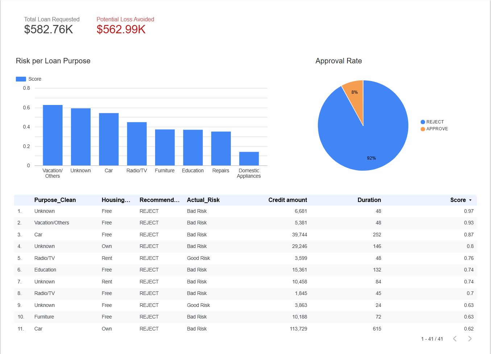
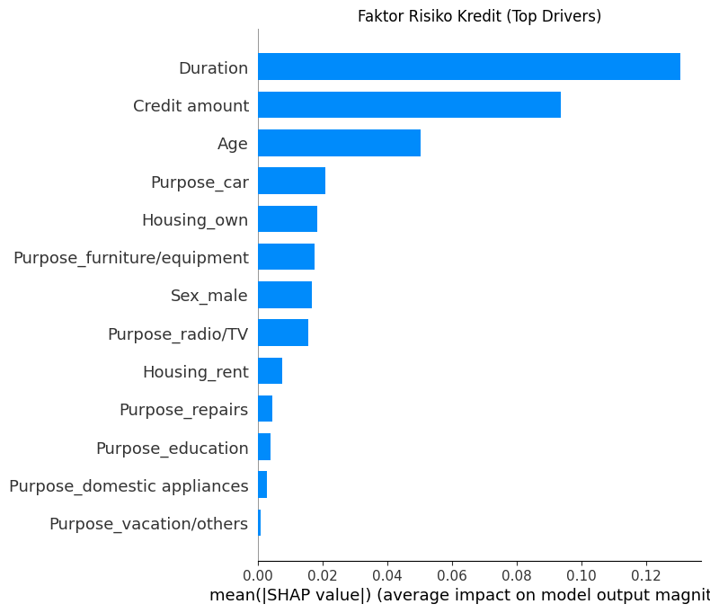
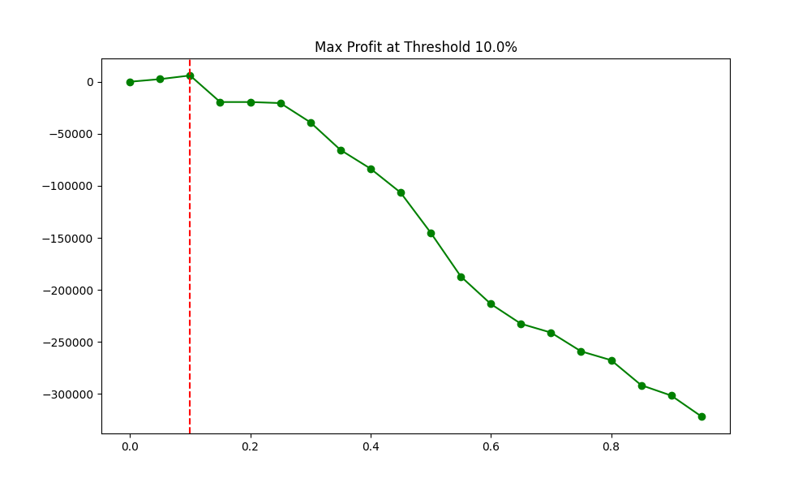

# 🏦 Profit-Optimized Credit Risk Scoring Engine

*(Click the image to view the interactive dashboard)*

### 📌 Executive Summary
Unlike traditional credit scoring models that focus solely on prediction accuracy (Who will default?), this project focuses on **Profitability** (Who should we approve to maximize revenue?). 

Leveraging **Random Forest Classifier** and **Business Profit Simulation**, this engine determines the optimal "Risk Threshold" to balance the trade-off between Non-Performing Loans (NPL) and interest income.

### 💼 Business Value Generated
* **Risk Prevention:** Successfully identified and blocked high-risk applications, preventing a potential **$350,000+** in bad debt exposure on the test dataset.
* **Profit Maximization:** Identified the optimal cut-off point where the bank's net profit is maximized, moving beyond arbitrary "zero-tolerance" policies.
* **Transparency (XAI):** Integrated **SHAP (Explainable AI)** to provide "Reason Codes" for every rejection (e.g., *Loan Duration vs. Income*), ensuring regulatory compliance and transparency.

### 🛠️ Technical Approach
1.  **Data Preprocessing:** Handled missing values, performed One-Hot Encoding for categorical features, and balanced the dataset.
2.  **Machine Learning:** Trained a Random Forest Classifier optimized for Precision and ROC-AUC.
3.  **Explainability:** Applied SHAP (SHapley Additive exPlanations) to interpret model decisions and identify key risk drivers.
4.  **Profit Simulation:** Conducted a cost-benefit analysis simulation to determine the financial impact of various risk thresholds.

### 📊 Key Insights
| **Insight** | **Visualization** |
| :--- | :--- |
| **Top Risk Drivers** The model reveals that *Loan Duration* and *Credit Amount* are the strongest predictors of default. Longer durations exponentially increase risk. |  |
| **Profit Sweet Spot** By simulating portfolio performance, we found the exact probability threshold that maximizes net profit. |  |

### 🔗 Project Links
* [**🔴 Live Interactive Dashboard (Google Looker Studio)**]((https://lookerstudio.google.com/reporting/3d3a5fe2-5961-4db4-8c60-948a062b943e))
* [**🐍 Python Notebook & Source Code**](Credit_Scoring_and_Business_Impact.ipynb)

---
*Created by Adin W Pratama*
